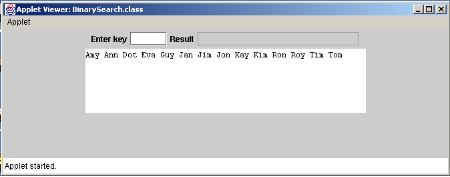
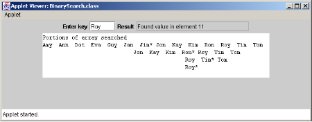

**Assignment 3	 		Binary Search of an Unordered Array**

**Question1**

Extend and Modify the code from the lectures on Binary Search of an ordered array to do the following:

1. The program must accept an array of 14 strings (not in order)

"Jon", "Dot", "Eva", "Roy", "Guy", "Jan", "Tom", "Jim", "Ann", "Kim", "Ron", "Tim", "Kay", "Amy".

1. Now use a suitable sorting algorithm to sort the array. You must call on your knowledge of strings as well. (e.g. rewrite Insertion Sort, Bubble Sort, Selection Sort to deal with strings and incorporate it into your solution).

1. Now adjust your binary search of an Ordered Array code to allow the user to enter a string and establish its position in the ordered array if it exists.

Here is a version that I mocked up in Java. You may use C++, OR you may like to try C#.

**Question 2				 		“Guess The Number”** 

The following exercise will use the principles that you have learned in the Binary Search of an Ordered Array lectures. 

Write an application that plays the “Guess the Number” game as follows: Your program chooses the number to be guessed by selecting a random integer between 1 and 1000. The application displays the prompt **Guess a number between 1 and 1000**. The user has a maximum of 10 guesses to figure out the number. The user types a guess and presses the ENTER key. If the user’s guess is incorrect, your program should display **Too High, Try Again** OR **Too Low, Try Again** to help the user to “zero in” on the correct answer and await the entry of another guess. When the user guesses the number correctly one of the following messages will appear in the status bar:

If the number is guessed in less than 10 tries display,

`	`**Either you know the secret or you got lucky!**

If the number is guessed in 10 tries display,

`	`**You know the secret!**

If the number is not guessed

`	`**You should be able to do better!**

**Hint:** Using the principles of Binary Search, with each good guess the user should be able to eliminate half of the numbers.

**Hint:** No array is needed to solve this problem.

The working version of the above, to be uploaded to Moodle on or before:

**Deadline: 11.59pm on April 17th (All Groups) - 20%. No uploads accepted after this deadline.**

***N.B.*** 

1) ***Take the appropriate steps to backup your work at all times.*** 

1) ***Deadline exceptions can only be made in special circumstances (e.g. provide sick cert).***

Suzanne O’ Gorman	Page 1	05/03/2024
